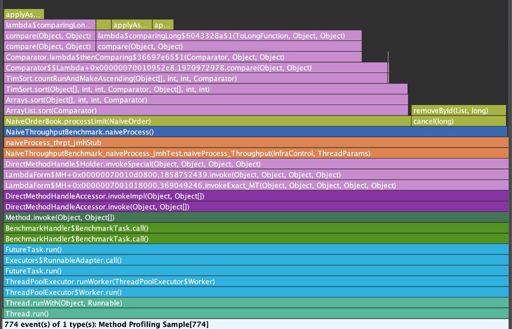

# LOB Engine — Benchmark Log

Results recorded here as each phase is completed.
Each entry includes hardware, JVM flags, workload description, and raw output.

---

## Naive Baseline

**Hardware:** Apple M4, MacBook Air, 16 GB RAM

**JVM:** Java 21.0.5 (HotSpot 64-bit), `-XX:-RestrictContended -XX:+UseG1GC -Xmx4g`

**Workload:** 60% limit orders (prices ±10 ticks around mid 5000), 20% market orders, 20% cancel operations, 1M pre-generated orders cycled per iteration

**Benchmark config:** `@Fork(1)`, `@Warmup(3 × 2 s)`, `@Measurement(5 × 3 s)`

**Result:** ~71,464 ops/sec

```
Benchmark                               Mode  Cnt      Score       Error  Units
NaiveThroughputBenchmark.naiveProcess  thrpt    5  71464.275 ± 35906.108  ops/s
```

The wide confidence interval (±35,906 ops/sec, roughly 50% of the mean) is not
measurement noise. It is the O(N) cost of the naive implementation revealing
itself over time. The book accumulates resting orders across iterations because
`@Setup(Level.Iteration)` resets only the array cursor, not the book state.
As depth grows, each insertion triggers a more expensive `ArrayList.sort()` over
an ever-longer list, so later iterations are measurably slower than earlier ones.

---

### JFR Hot Methods

```bash
# Record
java -XX:-RestrictContended -XX:+UseG1GC -Xmx4g \
  "-XX:StartFlightRecording=filename=docs/profiling/naive.jfr,settings=profile,dumponexit=true" \
  -jar build/libs/lob-matching-engine-1.0-SNAPSHOT-jmh.jar \
  NaiveThroughputBenchmark -wi 3 -w 2 -i 5 -r 3 -f 0

# Dump samples and analyse
jfr print --events "jdk.ExecutionSample" docs/profiling/naive.jfr > docs/profiling/jfr_samples.txt
python3 docs/profiling/analyse-jfr.py
# Output: docs/profiling/jfr-analysis-report.txt
```

**Flamegraph (JDK Mission Control):**



JMC renders this bottom-up: `Thread.run()` is the root at the bottom and the
leaf methods actually burning CPU are at the top. Reading upward from
`NaiveThroughputBenchmark.naiveProcess()`, the frame splits at
`NaiveOrderBook.processLimit()` into two branches:

- **Wide left branch (~81% of stacks):** `ArrayList.sort()` calls `Arrays.sort()`
  calls `TimSort.sort()` calls `TimSort.countRunAndMakeAscending()`, which fans
  out into the comparator lambda chain at the top. `TimSort.sort` appeared in
  609 of 756 samples (80.6% inclusive). `TimSort.countRunAndMakeAscending` was
  the top-of-stack leaf in 446 samples (59.0% exclusive), meaning it was the
  method directly burning CPU more than half the time.

- **Narrow right branch (~18% of stacks):** `cancel()` calls `removeById()`,
  appearing in 139 of 756 samples (18.4%). The overlap between the two branches
  is zero — no sample contained both a sort frame and a cancel frame, so the
  percentages can be added directly.

**Exclusive sample share (top-of-stack — where CPU was directly executing):**

| Rank | Method | Exclusive % | Role |
|------|--------|-------------|------|
| 1 | `TimSort.countRunAndMakeAscending` | 59.0% | Leaf of `List.sort()`, called after every limit order insertion — O(N log N) per insert |
| 2 | `NaiveOrderBook.removeById` | 18.4% | Linear scan of the bid/ask list on every cancel — O(N) per cancel |
| 3 | `Collections$ReverseComparator2.compare` | 16.5% | Comparator invoked thousands of times per sort for the descending-bid ordering |
| 4 | `TimSort.sort` | 4.9% | Sort orchestration overhead |

**Branch summary (inclusive — samples where each path was active):**

| Branch | Samples | % of total |
|--------|---------|------------|
| Sort (TimSort / Arrays.sort / ArrayList.sort) | 611 | 80.8% |
| Cancel (NaiveOrderBook.cancel / removeById) | 139 | 18.4% |
| Overlap (both in same sample) | 0 | 0.0% |
| Combined | 750 | 99.2% |

**Conclusion:** 99.2% of sampled CPU stacks trace to exactly two root causes
with zero overlap between them. The sort branch (80.8%) originates from the
single line `bids.sort(BID_ORDER)` / `asks.sort(ASK_ORDER)` in
`NaiveOrderBook.processLimit()`: every new resting limit order triggers a full
re-sort of the entire list. The cancel branch (18.4%) originates from
`removeById()` scanning the full list linearly for every cancel operation. Both
root causes share the same underlying problem: using an unordered `ArrayList`
and imposing order by repeated full-list mutation instead of choosing a data
structure that maintains order structurally.

**Optimization hypothesis:** A `TreeMap<Long, ArrayDeque<NaiveOrder>>` keyed by
`priceTicks` eliminates the sort entirely. The tree maintains price order
structurally at O(log L) insertion cost, where L is the number of distinct price
levels (at most 21 in this workload's ±10-tick window). A
`HashMap<Long, NaiveOrder>` by `orderId` reduces cancel lookup from O(N) to
O(1). Given that 80.8% of sampled stacks pass through the sorting path and the
replacement reduces that cost from O(N log N) over all resting orders to O(log L)
over price levels, the expected improvement is 20-40x, scaling with book depth
at measurement time.
